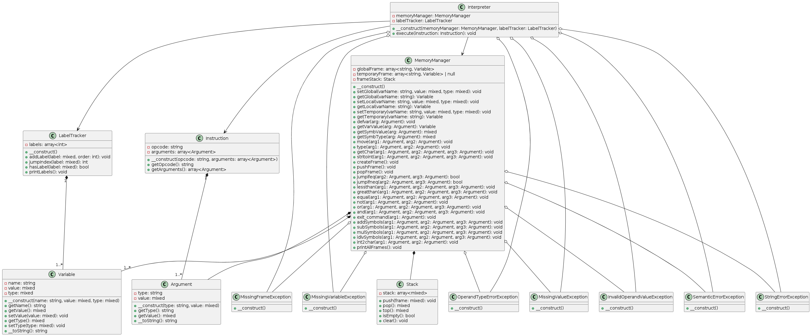

# Interpreter pre jazyk IPPcode24

###### Autor: Boris Semanco, xseman06

## Obsah

- [Úvod](#úvod)
- [Spustenie](#spustenie)
- [Architektúra](#architektúra)
  - [Interpreter](#interpreter)
  - [MemoryManager](#memorymanager)
  - [LabelTracker](#labeltracker)
  - [Stack](#stack)
  - [Variable](#variable)
  - [Argument](#argument)
  - [Instruction](#instruction)
- [Class Diagram](#class-diagram)
- [Výnimky](#výnimky)
- [Záver](#záver)

## Úvod

Tento interpreter je určený na vykonávanie skriptov v jazyku IPPcode24. Interpretuje a vykonáva jednotlivé inštrukcie, ktoré sú definované v danom jazyku.

## Spustenie

Aplikácia interpretera je spustiteľný súbor, ktorý sa spúšťa príkazom:

```
php8.3 interpreter.php --source=<xml-file> --input=<input-file>
```

Pre zobrazenie návodu treba spustiť s prepínačom `--help` ciže:
```
php8.3 interpreter.php --help
```

## Architektúra
Interpreter pozostáva z nasledujúcich tried:

#### Interpreter
Hlavná trieda, ktorá riadi interpretáciu skriptu. Obsahuje metódu execute, ktorá postupne vykonáva jednotlivé inštrukcie skriptu.

#### MemoryManager
Manažér pamäte, ktorý uchováva premenné v rôznych rámcoch. Obsahuje metódy na manipuláciu s premennými ako je `setGlobal`, `getGlobal`, `setLocal`, `getLocal`, `setTemporary`, `getTemporary` atď. Taktiež implementuje vačšinu inštrukcií jazyka IPPcode24.

#### LabelTracker
Trieda pre sledovanie labelov a ich pozícií v skripte. Umožňuje preskočiť na inštrukciu, ktorá je označená značkou. Obsahuje metódy `addLabel`, `jumpIndex`, `hasLabel` a debug funkciu `printLabels`.

#### Stack
Implementácia zásobníka pre ukladanie rámcov pamäte, stack taktiež využíva interpret aj na zásobnikové inštrukcie. Obsahuje metódy `push`, `pop`, `top`, `isEmpty` a `clear`.

#### Variable
Predstavuje premennú so svojím názvom, hodnotou a typom. Poskytuje metódy na získanie a nastavenie týchto atribútov.

#### Argument
Predstavuje argument použitý v inštrukciách. Obsahuje informácie o type a hodnote argumentu.

#### Instruction
Predstavuje inštrukciu v jazyku IPPcode24, obsahujúcu operátor a zoznam argumentov.

### Class Diagram




### Výnimky
Interpreter definuje niekoľko výnimiek, ktoré sa môžu vyskytnúť počas vykonávania skriptu:

`MissingFrameException`: Výnimka sa vyvolá, ak chýba očakávaný rámec (napr. lokálny rámec).
`MissingVariableException`: Výnimka sa vyvolá, ak sa pokúšate pristupovať k neexistujúcej premennej.
`OperandTypeErrorException`: Výnimka sa vyvolá, ak operátor očakáva iný typ operandu.
`MissingValueException`: Výnimka sa vyvolá, ak chýba očakávaná hodnota.
`InvalidOperandValueException`: Výnimka sa vyvolá, ak je hodnota operandu neplatná.
`SemanticErrorException`: Výnimka sa vyvolá, keď sa vyskytne chyba v sémantike skriptu.
`StringErrorException`: Výnimka sa vyvolá, ak sa vyskytne chyba pri manipulácii so stringami.


### Záver

Tento interpreter poskytuje robustnú implementáciu pre vykonávanie skriptov v jazyku IPP. S jeho použitím môžete jednoducho interpretovať a vykonávať skripty, čím automatizujete rôzne úlohy a procesy.
